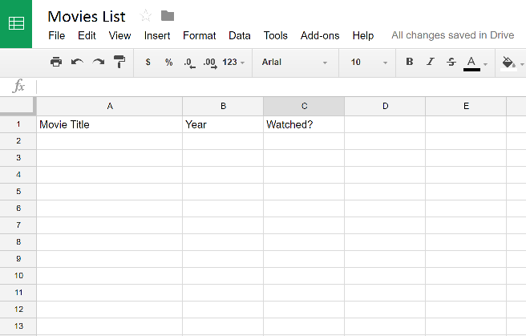

# movie-selection

This project randomly selects a movie and sends an email notification to persons of interest using a Gmail addresss.

## Requirements
- Python 3
- `pip install requests httplib2`
- A Google Account
- Steps 1 & 2 from the [Google Sheets Python Quickstart Guide](https://developers.google.com/sheets/api/quickstart/python)
- [Allow “less secure apps” on your Gmail account](https://www.google.com/settings/security/lesssecureapps)
- Google Sheet with columns A-C labelled "Movie Title", "Year" and "Watched?"

## How to Use
Once you've satisfied the requirements above, simply run `python movies.py` from your CLI and enjoy your movie!

## References
Referenced the following sources during development:
- https://developers.google.com/sheets/api/quickstart/python
- http://rosettacode.org/wiki/Send_email#Python
- http://naelshiab.com/tutorial-send-email-python/
- https://www.dataquest.io/blog/python-api-tutorial/
- https://www.omdbapi.com/